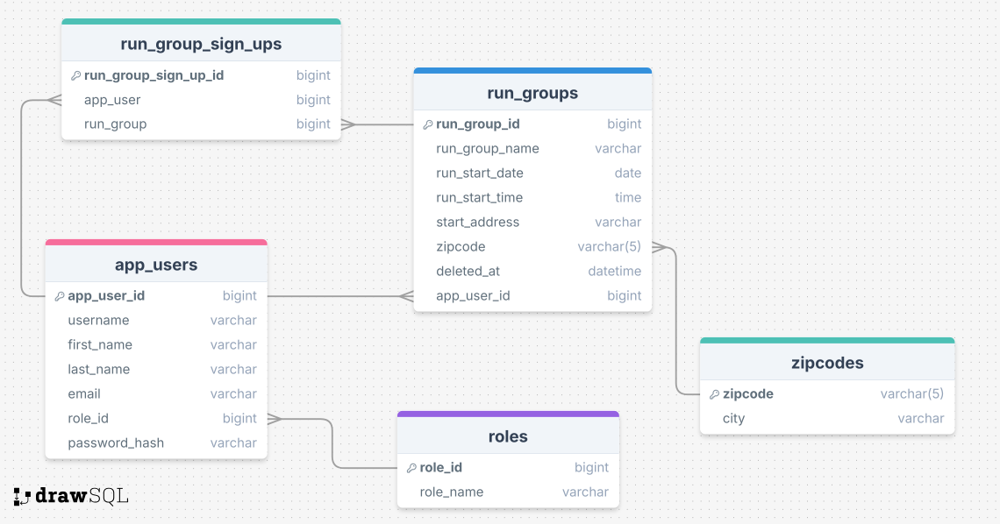

# RunFinder

RunFinder is an application designed to help runners find run groups in their city.

This project is the final course work for Back End Programming course at Haaga-Helia university of applied sciences.

## Main features

The main feature of RunFinder is that the users are able to find and sign up to run groups. Users are able to see a list of upcoming run groups, see to which run groups they have signed up on, and, based on authorization level, add, edit, delete and restore run groups. RunFinder also has a search functionality and provides limited API access through REST.

Runfinder has three authorization levels:

1. App users
2. Contributors
3. Admins

### App users can

- see upcoming run groups
- sign up to upcoming run groups
- delete their sign up
- search run groups
- see their user information
- edit parts of their user information

### Contributors can

- do all of the above
- add new run groups
- edit their run groups
- delete their run groups
- see how many have signed up to their run groups

### Admins can

- do all of the above
- see all run groups
- edit, delete and restore all run groups
- see all signed up users (app users, contributors, admins)
- edit every user's user information
- edit user's access level

## RunFinder database diagram

